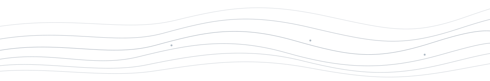

  

# Soroush Karahrodi

**Tourism Intelligence · Geospatial Research · Decision Systems**

I build evidence-first systems that turn geospatial, climate and field data into
defensible decisions for tourism destinations and protected areas.

---

## Selected work

### [SNTO — Smart Nature Tourism Observatory](https://github.com/soroushkarahrodi79-oss/snto-smart-tourism-observatory)
Protected-area decision intelligence built on Earth observation and explicit
evidence/provenance. Sentinel-2 signal → calibrated ecological indicators →
causal attribution (tourism pressure vs. climate) → budgeted, confidence-scored
investment priority, applied to Parque Nacional Sierra de Guadarrama (218 trails,
official OAPN cartography).

[Live dashboard](https://snto-observatory.happyground-be027676.swedencentral.azurecontainerapps.io/) · [DOI](https://doi.org/10.5281/zenodo.20818269) · [Whitepaper](https://github.com/soroushkarahrodi79-oss/snto-smart-tourism-observatory/blob/main/WHITEPAPER_SNTO_Architecture_Blueprint.md)

### [Open Travel CRM](https://github.com/soroushkarahrodi79-oss/travel-agency-crm-google-sheets)
A self-hosted, secure CRM for small travel agencies that runs on Google Sheets
and Apps Script — leads, reservations, installment payments, roles and an audit
trail, without a database server.

[Interactive demo](https://soroushkarahrodi79-oss.github.io/travel-agency-crm-google-sheets/)

### [FieldOS](https://github.com/soroushkarahrodi79-oss/fieldos)
Offline-first field research PWA for structured tourism evidence: sessions,
observations, GPS provenance and photos captured on-device, exported as
portable JSON/CSV/GeoJSON with no network dependency.

[Deployment](https://fieldos-sigma.vercel.app)

---

## Research & experiments

- **[SNTO Alpine](https://github.com/soroushkarahrodi79-oss/snto-alpine)** — a research extension of SNTO applying the same engine to a second, high-mountain pilot (Sierra Nevada). Explicitly does not inherit the base project's release lineage, DOI, or field-validation status; treated as its own prototype, not a competing flagship.
- **[Tourism Signal Radar](https://github.com/soroushkarahrodi79-oss/radar)** — a pre-build validation experiment testing whether a structured Signal → Evidence → Decision → Action workflow beats a plain note template, before any production software gets written.

---

## What I work on

- Tourism decision intelligence
- Earth observation & geospatial evidence
- Field-to-decision research systems

I care about provenance, uncertainty, and knowing when a system should **not**
make a recommendation.

---

## Toolchain

Python · TypeScript · PostGIS · Google Earth Engine · Sentinel-2 / Copernicus · Azure · GitHub Actions

---

DOI and dashboard links above point to live, verifiable endpoints as of this writing.
