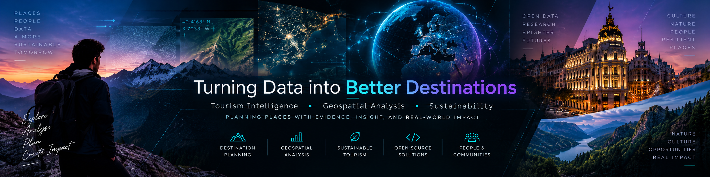

  

  <strong>Tourism Intelligence · Geospatial Research · Decision Systems</strong>

  Building evidence-first systems for better decisions about places.

I work at the intersection of **tourism, geospatial analysis, climate adaptation and environmental research**.

I design research and software workflows that turn **spatial, environmental and field evidence** into transparent decision support — while keeping provenance, uncertainty, validation and the limits of the evidence visible.

---

## Selected work

### [SNTO — Smart Nature Tourism Observatory](https://github.com/soroushkarahrodi79-oss/snto-smart-tourism-observatory)

**Earth observation and spatial evidence for protected-area decision support.**

SNTO combines Sentinel-2 with official territorial data to monitor environmental-condition and environmental-change signals in **Parque Nacional Sierra de Guadarrama**.

The system turns those signals into evidence-aware monitoring and field-inspection priorities while keeping provenance, uncertainty and validation boundaries explicit.

It does **not** claim to directly measure tourism pressure or establish a causal relationship between tourism activity and environmental change.

**[Live dashboard](https://snto-observatory.happyground-be027676.swedencentral.azurecontainerapps.io/)** · **[DOI](https://doi.org/10.5281/zenodo.20818269)** · **[Whitepaper](https://github.com/soroushkarahrodi79-oss/snto-smart-tourism-observatory/blob/main/WHITEPAPER_SNTO_Architecture_Blueprint.md)**

---

### [HATI-Madrid — Heat-Aware Tourism Intelligence](https://github.com/soroushkarahrodi79-oss/heat-adaptive-tourism-madrid)

**Researching how thermal evidence can support heat-aware tourism decisions in cities.**

HATI is a reproducible research pilot focused on **heat-adaptive urban tourism opportunity screening** in central Madrid.

It compares alternative thermal representations inside a constraint-first decision architecture, keeping thermal conditions, eligibility, evidence and uncertainty separate rather than collapsing them into a single opaque score.

**[ResearchGate](https://www.researchgate.net/publication/414226835_Thermal_representation_as_a_decision_variable_in_heat-adaptive_tourism_opportunity_screening_evidence_from_a_Madrid_pilot)** · **[DOI](https://doi.org/10.5281/zenodo.22707470)**

**Research status:** public non-peer-reviewed preprint. HATI is a research prototype, not an operational or real-time tourism system.

---

### [FieldOS](https://github.com/soroushkarahrodi79-oss/fieldos)

**Offline-first infrastructure for structured field evidence.**

FieldOS is a field-research PWA designed to capture observations without depending on permanent connectivity or a backend.

It supports:

- research sessions;
- GPS provenance;
- structured observations;
- photographs;
- voice notes;
- revision history;
- spatial inspection;
- JSON, CSV and GeoJSON export;
- portable full-session backups.

The goal is simple: make field evidence easier to collect, preserve, inspect and reuse without losing its provenance.

**[Live deployment](https://fieldos-sigma.vercel.app)**

---

## Explore the research ecosystem

### [Spatial Intelligence Atlas](https://github.com/soroushkarahrodi79-oss/spatial-intelligence-atlas)

A visual entry point into the research questions behind my main projects.

The Atlas connects work around:

**territory → evidence → interpretation → decision**

and shows how projects such as **SNTO, HATI, FieldOS, FAB and FIRSTLOOK-MAD** relate conceptually.

**[Open the Atlas](https://soroushkarahrodi79-oss.github.io/spatial-intelligence-atlas/)**

> These are separate research and software systems with related methodological questions — not one technically integrated platform.

---

## More research & experiments

### [FIRSTLOOK-MAD](https://github.com/soroushkarahrodi79-oss/firstlook-mad)

A falsification-first research prototype investigating whether a distributed UAS network could improve **Time To First Reliable Picture** for wildfire response in the Community of Madrid.

The project separates:

**evidence → assumptions → simulation → decision gates**

rather than treating simulated performance as operational evidence.

**Research/simulation only:** no drone control, emergency dispatch or operational flight claims.

---

### [FAB — Field Atlas](https://github.com/soroushkarahrodi79-oss/fab)

An interactive research instrument connecting **territory, Earth observation, signals, provenance and decision scenarios**.

FAB is designed to keep authentic, derived and simulated evidence distinguishable instead of presenting everything as if it had the same evidential status.

---

### [Tourism Signal Radar](https://github.com/soroushkarahrodi79-oss/radar)

A pre-build validation experiment exploring whether a structured:

**Signal → Evidence → Decision → Action**

workflow produces more defensible research decisions than unstructured signal collection.

The project tests the decision logic before committing to a larger software system.

---

### [SNTO Alpine](https://github.com/soroushkarahrodi79-oss/snto-alpine)

An independent research prototype testing parts of the SNTO approach in a second high-mountain context in **Sierra Nevada**.

It is treated as a separate research environment and does not automatically inherit the validation, evidence or release claims of the original SNTO project.

---

## Applied software

### [Open Travel CRM](https://github.com/soroushkarahrodi79-oss/travel-agency-crm-google-sheets)

An open-source CRM prototype for small travel agencies built with **Google Sheets and Apps Script**.

It supports:

- lead management;
- reservations;
- installment payments;
- role-based workflows;
- audit history;
- lightweight agency administration.

The system is designed for organizations that need structured workflows without maintaining a conventional database server.

**[Interactive demo](https://soroushkarahrodi79-oss.github.io/travel-agency-crm-google-sheets/)**

---

## How I work

### Evidence before recommendation

I try to keep four things separate:

**1. Observed**

What was actually measured, acquired or retrieved from a source.

**2. Derived**

What was calculated, transformed, classified or modelled from those observations.

**3. Simulated / provisional**

What depends on assumptions, scenarios or incomplete validation.

**4. Decision**

What the available evidence genuinely supports doing.

This distinction matters because a technically sophisticated system can still produce a bad decision if the evidence underneath it is weak.

Sometimes the correct output is not another ranking or score.

Sometimes the correct output is:

> **NO EVIDENCE / ABSTAIN**

---

## Research focus

My current work is concentrated around:

**Tourism decision intelligence** · **Smart and sustainable destinations** · **Climate adaptation** · **Protected areas** · **Remote sensing** · **Spatial evidence** · **Earth observation** · **Field research systems** · **Reproducible decision support**

I am particularly interested in problems where **territory, environmental conditions and human decisions interact**.

---

## Toolchain

**Data & geospatial**

Python · GeoPandas · PostGIS · Google Earth Engine · Sentinel-2 / Copernicus

**Web & interfaces**

TypeScript · React · MapLibre

**Infrastructure & reproducibility**

Azure · GitHub Actions · Git · reproducible research workflows

---

## What connects these projects?

The domains vary — protected areas, urban heat, wildfire response, field research and tourism operations — but the underlying question is often the same:

> **How can imperfect spatial evidence be turned into a decision without pretending that the evidence is stronger than it really is?**

That is the thread connecting most of my work.

---

## Collaboration

I'm interested in research and open-source collaboration around:

- tourism intelligence;
- geospatial decision support;
- climate adaptation;
- Earth observation;
- protected-area management;
- field evidence systems;
- reproducible spatial research.

If you're working on an adjacent problem, have a dataset worth testing, disagree with one of my methodological choices, or see a useful collaboration opportunity, feel free to open an issue in the relevant repository.

**Research ideas, methodological criticism and useful counter-evidence are welcome.**
