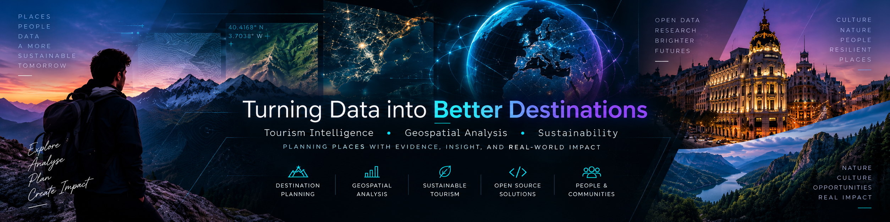

  

<strong>Tourism Intelligence · Geospatial Decision Systems · Reproducible Research</strong>

Building evidence-first systems for cities, destinations and protected areas.

I build geospatial research software and decision-support tools where tourism, territorial planning and environmental evidence meet. The work spans interactive city analysis, Earth observation, spatial regression checks and offline field research.

Each project makes its sources, transformations and limits inspectable. The aim is to turn imperfect spatial evidence into a defensible interpretation—and to show when it does not support a decision.

## Flagship work

### [Madrid Urban Evidence Lens](https://github.com/soroushkarahrodi79-oss/madrid-tourism-intelligence-lens)

**Explore what official sources document about a place in Madrid, at a spatial window you control.**

A comparative map workspace for local evidence on urban development, tourism, mobility and bounded heat context. Tourism remains one documented domain; the broader urban-evidence direction is in development, with no production planning layer today.

[Live lens](https://soroushkarahrodi79-oss.github.io/madrid-tourism-intelligence-lens/) · [Repository](https://github.com/soroushkarahrodi79-oss/madrid-tourism-intelligence-lens) · [Scope and limits](https://github.com/soroushkarahrodi79-oss/madrid-tourism-intelligence-lens/blob/main/docs/GATE_K_URBAN_DECISION_WORKSPACE.md)

### [GeoImpact CI](https://github.com/soroushkarahrodi79-oss/geoimpact-ci)

**Know the spatial blast radius before you merge.**

A deterministic geospatial regression tool that checks how changed polygon geometries alter declared downstream spatial relationships, then emits reproducible evidence and a CI PASS/BLOCK result. Its stable v1 contract is intentionally narrow.

[Repository](https://github.com/soroushkarahrodi79-oss/geoimpact-ci) · [v1.2.0 release](https://github.com/soroushkarahrodi79-oss/geoimpact-ci/releases/tag/v1.2.0)

### [SNTO — Smart Nature Tourism Observatory](https://github.com/soroushkarahrodi79-oss/snto-smart-tourism-observatory)

**Use satellite-derived environmental signals to direct attention toward field inspection.**

For Sierra de Guadarrama, SNTO processes Sentinel-2 observations into environmental-condition and change indicators alongside official spatial context. It does not measure visitor pressure or establish tourism causation; field validation and stronger decision claims remain gated.

[Live dashboard](https://snto-observatory.happyground-be027676.swedencentral.azurecontainerapps.io/) · [Repository](https://github.com/soroushkarahrodi79-oss/snto-smart-tourism-observatory) · [Zenodo record](https://doi.org/10.5281/zenodo.20818269)

### [HATI-Madrid](https://github.com/soroushkarahrodi79-oss/heat-adaptive-tourism-madrid)

**Test how thermal representation changes heat-aware tourism opportunity screening.**

A reproducible central-Madrid research pilot comparing alternative thermal methods in a transparent, constraint-first screening architecture. The public preprint reports a bounded, single-day pilot; it is not an operational tourism service or peer-reviewed study.

[Repository](https://github.com/soroushkarahrodi79-oss/heat-adaptive-tourism-madrid) · [Research preprint](https://www.researchgate.net/publication/414226835_Thermal_representation_as_a_decision_variable_in_heat-adaptive_tourism_opportunity_screening_evidence_from_a_Madrid_pilot) · [Zenodo DOI](https://doi.org/10.5281/zenodo.22707470)

### [FieldOS](https://github.com/soroushkarahrodi79-oss/fieldos)

**Capture structured field evidence offline and carry its provenance with it.**

An offline-first field research PWA for protocol-bound observations, GPS provenance, media, revision history and portable JSON/CSV/GeoJSON backups. A first owner-attested iPhone field run is documented; broad or cross-platform validation is still pending.

[Try the deployed MVP](https://fieldos-sigma.vercel.app/) · [Repository](https://github.com/soroushkarahrodi79-oss/fieldos) · [Field-run record](https://github.com/soroushkarahrodi79-oss/fieldos/blob/main/docs/FIRST_FIELD_RUN.md)

## Evidence behind the work

Inspectable live systems and public repositories; tagged software releases; reproducible data pipelines with recorded provenance; CI and automated checks; archived research outputs with DOIs; and contributions reviewed in upstream open-source projects. These are different forms of evidence, with different limits.

## Open-source contributions

- [geemap #2887](https://github.com/gee-community/geemap/pull/2887) — **merged** test coverage for `rgb_to_hex`.
- [pystac-client #934](https://github.com/stac-utils/pystac-client/pull/934) — **open** contribution adding a public setter for search parameters.

## Selected research

- [Iran Soil Landscapes](https://github.com/soroushkarahrodi79-oss/iran-soil-landscape) — reproducible acquisition and processing for a national dominant-soil map, with SRTM terrain used as cartographic context rather than soil evidence.
- [CHALUS](https://github.com/soroushkarahrodi79-oss/CHALUS) — a historical road-accessibility study stopped at **NO-GO** when route correspondence and operational-status evidence did not meet the pre-registered verification standard. Stopping before Earth-observation analysis was the scientifically correct result.

## How I work

**Place → Evidence → Interpretation → Decision**

**Observed** ↓ **Derived** ↓ **Modelled / provisional** ↓ **Decision**

These states are not interchangeable. Recommendations stay within the evidence ceiling; when support is insufficient, the result is **abstain**. Evidence before recommendation.

## Toolchain

**Geospatial & data:** Python · GeoPandas · Shapely · PyProj · PostGIS · Google Earth Engine · Sentinel-2 
**Interfaces:** TypeScript · React · Leaflet · MapLibre 
**Engineering:** Git · GitHub Actions · reproducible workflows · Azure where the project requires it

Research archive & experiments

- [Tourism Intelligence Desk](https://github.com/soroushkarahrodi79-oss/tourism-intelligence-desk) — integration prototype presenting bounded HATI and SNTO evidence; it does not replace either research source.
- [Spatial Intelligence Atlas](https://github.com/soroushkarahrodi79-oss/spatial-intelligence-atlas) — static explanatory map of selected research cases, not an integrated platform.
- [FIRSTLOOK-MAD](https://github.com/soroushkarahrodi79-oss/firstlook-mad) — simulation-only, falsification-first UAS wildfire-response research prototype.
- [FAB — Field Atlas](https://github.com/soroushkarahrodi79-oss/fab) — research instrument with mixed authentic, derived and simulated evidence; its real Sentinel-2 data seam is not wired.
- [Tourism Signal Radar](https://github.com/soroushkarahrodi79-oss/radar) — validation record; standalone build was not authorized.
- [SNTO Alpine](https://github.com/soroushkarahrodi79-oss/snto-alpine) — derived Sierra Nevada prototype; it does not inherit the base SNTO project's validation or DOI.
- [Kelar](https://github.com/soroushkarahrodi79-oss/Kelar) — inception and bounded retrieval-pilot records; formal evidence acquisition and case analysis are not authorized or complete.
- [JOB](https://github.com/soroushkarahrodi79-oss/JOB) — flexible-work marketplace prototype with synthetic data and simulated adapters.

## Contact

[LinkedIn](https://www.linkedin.com/in/soroush-karahrodi-8672247a/) · [ResearchGate](https://www.researchgate.net/profile/Soroush-Karahrodi) · [GitHub](https://github.com/soroushkarahrodi79-oss)
